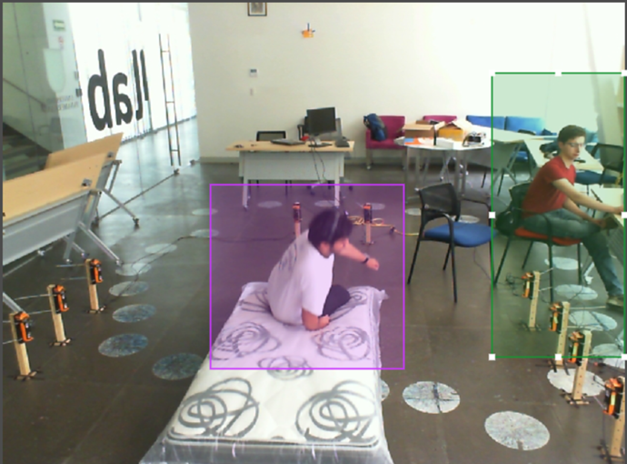
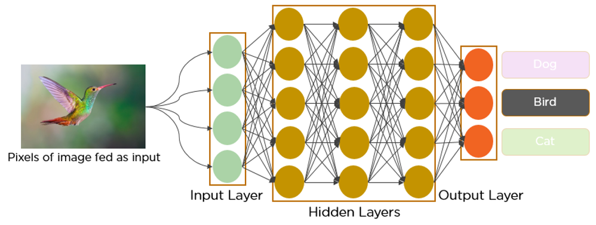
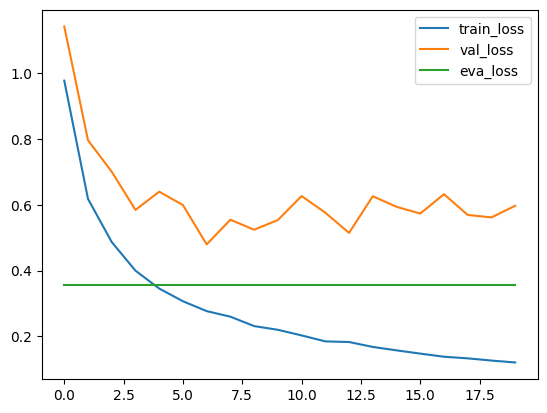
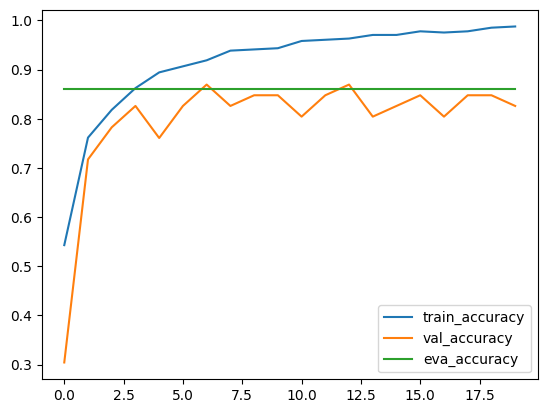
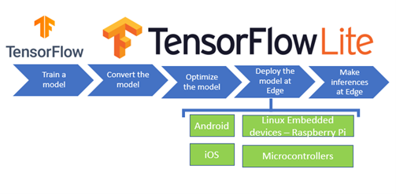
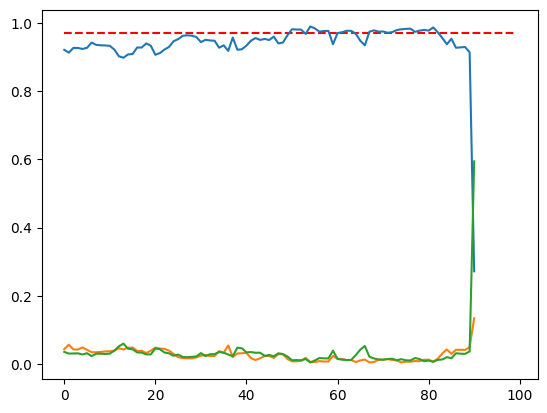
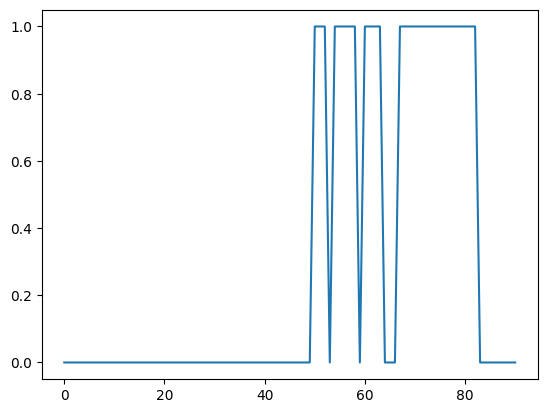

<p style="text-align: center;">Báo Cáo Đồ Án Cuối Kì</p>
<h1 style="text-align: center;">Phát Hiện Người Bị Té Ngã<br>Bằng Thiết Bị Nhúng</h1>
<p style="text-align: center;"><i>Fall Detection Using AIoT Camera</i></p>
<p style="text-align: center;">3rd semester, Academic Year: 2022 – 2023</p>


# I. Thông Tin
- Lê Trần Trung Hiếu
- MSSV: 20127158
- Lớp: 20TGMT

# II. Giới Thiệu
Té ngã là hiện tượng thường gặp có thể xảy ra với mọi người. Trong phần lớn trường hợp, té ngã xảy ra khi con người bất cẩn khi di chuyển trên những địa hình không bằng phẳng như cầu thang hay đường mòn, nhưng cũng không ít trường hợp là do người bị tai nạn không có đủ nhận thức do các vấn đề sức khỏe, người già, trẻ em, người say rượu.

Theo thống kê của CDC vào năm 2020 tại Mĩ, cứ mỗi 1000 ca nhập viện do té ngã thì có khoảng 350 ca tử vong, diều này gây thiệt hại cho nền y tế nước này khoảng 50 tỉ đô.

Với một hệ thống phát hiện người bị té ngã trong khu vực công cộng ước tính có thể giảm thiểu 80% các ca tai nạn dẫn đến nhập viện 

<p align="center">
  
</p>

# III. Về Bài Toán
## 1. Động Lực Nghiên Cứu
- Đây là bài toán thuộc nhóm object detection (phát hiện vật), action detection (phát hiện hành động)
- Phát triển mô hình đủ nhỏ để chạy được trên các thiết bị IoT hoặc không tốn quá nhiều tài nguyên khi chạy nền

## 2. Động Lực Thực Tiễn
- Giảm tỉ lệ thương tật, tử vong do té ngã
- Phát hiện các ca té ngã do đột quỵ hoặc các vấn đề sức khỏe khác
- Giảm tải cho hệ thống cấp cứu

## 3. Phát Biểu Bài Toán
Cho một luồng video có kích thước `(224,224,3)` với số khung hình tối thiểu một giây là 15. xác định có hay không người ở trong khung hình đang ở trạng thái té ngã. Nếu có, trong một khoảng thời gian đủ dài, phát cảnh báo cho những đối tượng chỉ định 

# III. Môi Trường & Quy Cách
- Google Colaboratory Container (22.04 LTS)
- Target Device: `Adruino/Generic`

# IV. Cách Thức Hoạt Động
## 1. Tập Học & Lọc Dữ Liệu
Tập học `Fall Detection Dataset` gồm 485 ảnh từ các nguồn được tổng hợp trên internet. Trong đó có 3 nhãn chính là `Fall Detected`, `Walking`, `Sitting` dược gán cho mỗi người xuất hiện trong hình

<p align="center">
  
</p>

```
0 0.476950 0.665485 0.209220 0.347518
2 0.914894 0.457447 0.170212 0.423168
```
Vì mục tiêu của chúng ta là xác định có người bị ngã hay không với độ phân giải thấp nên để tăng số lượng mẫu học, ta cắt tất cả các phần bên trong bounding box của mỗi hình và thay đổi kích thước chúng thành `(224,224,3)` với mỗi hình có duy nhất một con số `0~2` đại diện cho nhãn của tập học

## 2. Huấn Luyện Mô Hình
<p align="center">
  
</p>

Ta sẽ dùng kiến trúc `MobileNetV3Small` để huấn luyện vì các lý do sau:

- Mô hình áp dụng các kĩ thuật SOTA có trong các mô hình hàng đầu hiện nay
- Mô hình dược tối uư để chạy trên các thiết bị nhúng
- Cho độ chính xác chấp nhận được
- Kích thước nhỏ so với các mô hình khác

| Loss | Accuracy|
| - | - |
|  | 

Kết quả huấn luyện và kiểm thử cho kết quả dự đoán chính xác khoảng 86%, đây là kết quả chấp nhận được cho mục đích của bài toán.

## 3. Thu nhỏ mô hình

<p align="center">
  
</p>

Để tối ưu hóa việc chạy trên các thiết bị nhúng, ta lưu nó thành một model `tflite`

```python3 
converter = tf.lite.TFLiteConverter.from_keras_model(model)
tflite_model = converter.convert()
```

Sau đó, cần nhúng mô hình này vào file `model.h` để mô hình được lưu vào bộ nhớ của adruino.

```bash
echo "const unsigned char model[] = {" > model.h
cat model.tflite | xxd -i >> model.h
echo "};" >> model.h
```

<center>

| Mô Hình | Kích Thước |
| - | - |
| model.tflite | 3.57 MiB |
| model.h | 21.99 MiB |
</center>


# V. Kết Quả Thực Tế
Để mô phỏng quá trình chạy thực tế, ta truyền một video dưới dạng luồng hình ảnh qua mô hình. Video ví dụ ở `/model/sample.mp4` với kích thước `(100,224,224,3)`

```
...
frame: 20 | Fall: 0.882396 | Walk: 0.059373 | Sit: 0.0582301
...
```

| Kết Quả Thô | Kết Quả Xử Lý |
| - | - |
|  | 

`Nhận Xét`: Ta có thể thấy rằng kết quả dự đoán hành động không chính xác, do có sự khác nhau giữa tập học và thực tế, tuy nhiên nếu ta nâng threshold lên 0.95 thì kết quả tương đối giống với video

`Kết Luận`: Dù chưa chính xác nhưng ta thấy mô hình hiểu khái niệm của việc té ngã và có khả năng cảnh báo nếu có người trong khung hình bị té ngã

# VI. Thách Thức và Hướng phát triển
- Tập học nhỏ do dữ liệu công khai không nhiều.
- Yêu cầu phần cứng dù thấp nhưng không hoạt động ổn định trên các micro-controler bậc thấp
- Độ chính xác chưa cao, chủ yếu là false-positive
- Có thể thêm các mạng relay để tăng khả năng nhận diện hành động

# IV. Trích Nguồn và Các công trình liên quan
1. Báo Cáo Của CDC
- https://www.cdc.gov/falls/facts.html

2. <cite>Pérez Alvarez, J. (2017). Intelligent Monitoring and Supervision Systems for Real-Time Fault Detection and Diagnosis. In A. Grau Saldes & A. Sanfeliu Cortés (Eds.), Intelligent Systems and Applications (pp. 1-28). IntechOpen.</cite>

- https://www.intechopen.com/chapters/70649
3. <cite>Theodoropoulos, G., Katsoulis, G., & Vlachos, D. (2020). A Deep Learning-Based Fault Detection Model for Optimization of Shipping Operations and Enhancement of Maritime Safety. IEEE Access, 8, 216701-216714.</cite>
- https://www.mdpi.com/1424-8220/21/16/5658

4. Fall Detection Dataset
- https://www.kaggle.com/datasets/uttejkumarkandagatla/fall-detection-dataset

5. Adruino Image Reduction Tutorial
- https://colab.research.google.com/github/arduino/ArduinoTensorFlowLiteTutorials/blob/master/GestureToEmoji/arduino_tinyml_workshop.ipynb