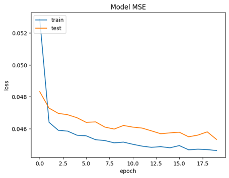

<p style="text-align: center;">Báo Cáo Chuyên Đề</p>
<h1 style="text-align: center;">CSC16105 – Truy vấn thông tin thị giác</h1>
<p style="text-align: center;">3rd semester , Academic Year: 2022 – 2023</p>

<p align="center">
  
</p>

# I. Thông Tin
- 20127158 - Lê Trần Trung Hiếu
- 20127309 - Nguyễn Lê Sơn

# II. Giới Thiệu
Hiện nay, chúng ta có rất nhiều món ăn ngon ở rất nhiều nơi trên thế giới và mỗi món như vậy sẽ có các công thức món ăn để chúng ta nấu ăn nó. Với tâm lý của một người trải nghiệm món ngon và thưởng thức món đó lại, họ rất muốn có công thức nấu ăn. Tuy vậy, việc có công thức nấu ăn trở nên khó vì không ai cho hết, có các món tên khác nhau nhưng cùng công thức nấu ăn,…. Chính vì vậy, việc sử dụng hình ảnh để truy vấn món ăn và công thức trở nên thực dụng.<br>
Vậy công cụ truy vấn công thức món ăn bằng hình ảnh như thế nào, sử dụng phương pháp gì hay mô hình mạng nào để thực hiện. Đó là những gì mà chúng tôi sẽ báo cáo trong đồ án này.

# III. Về Bài Toán
## 1. Động Lực Nghiên Cứu
- Đây là bài toán object detection (phát hiện vật), bóc tách đối tượng và phân loại đối tượng (đối tượng ở đây là thức ăn, các thành phần thức ăn)
- Để phân biệt được các món ăn, ta cần có một dữ liệu lớn hình ảnh các đồ ăn đó song song với công thức nấu ăn về món đó.

## 2. Động Lực Thực Tiễn
Phần mềm truy vấn hình ảnh còn có nhiều ứng dụng khác hiện nay như là:
+ Truy vấn nội dung hình ảnh.
+ Truy vấn văn bản.
+ Truy vấn logo.
+ Truy vấn hình ảnh con người, …

## 3. Phát Biểu Bài Toán
Chúng ta sẽ có đầu vào là một ảnh món ăn màu RGB. Trên hình ảnh đó, chúng ta sẽ chỉ có một món ăn ở trên ảnh, ít các vật trang trí, rau củ xung quanh để giảm thiểu khả năng xác định món ăn của phần mềm.
Với đầu vào như vậy, chúng ta sẽ sử dụng những công thức, các công cụ công nghệ, các phương pháp nào để từ đó tạo ra một đầu ra là công thức món ăn gồm danh sách nguyên liệu, các bước chế biến, các lưu ý,…

<p align="center">
  
</p>

Để dễ nắm nội dung và thực hiện đồ án trên, ta sẽ giới hạn lại bài toán trên. Đầu vào của bài toán trên là các món ăn Việt Nam và một vài món ăn khác mà nhóm tìm thấy (bởi vì có nhiều món ăn ở nhiều nước khác nhau nên phải giới hạn lại để dễ thực hiện) với các điều kiện như đã nêu từ đầu phần phát biểu bài toán này. Đầu ra ở đây một công thức nấu ăn với các nguyên liệu chính và cách thực hiện đơn giản nhất có thể.

## 4. Các Công Trình Liên Quan

Với đồ án này, chúng mình cũng tìm được các bài báo cáo hay link code về đồ án trên. Tất cả các bài báo cáo trên đều sử dụng CNNs để thực hiện. Về tổng thể, đồ án này có một số cách để lấy công thức món ăn từ hình ảnh

| Tên Công Trình | Cách Thức Hoạt Động |
| - | - |
| Food-Recipe-CNN<sup>[3] | Sử dụng mạng nơ-ron tích chập sâu với Keras để phân loại hình ảnh thành các loại thực phẩm và đưa ra một công thức phù hợp |
| Extraction of Recipes from Food Images by Using CNN Algorithm<sup>[1] | Sử dụng hệ thống Reverse Cooking system để phục hồi các công thức nấu ăn dưới dạng tên công thức, thành phần và quy trình nấu từ hình ảnh thực phẩm đầu vào |
| Inverse Cooking: Recipe Generation from Food Images<sup>[2] | Hệ thống dự đoán các thành phần dưới dạng tập hợp bằng một kiến trúc mới, lập mô hình phụ thuộc của chúng mà không áp đặt bất kỳ thứ tự nào, sau đó tạo ra các hướng dẫn nấu ăn bằng cách đồng thời chú ý đến cả hình ảnh và các thành phần được suy luận của nó |
| Indexing of CNN Features for Large Scale Image Search<sup>[4] | Phương pháp thực hiện Indexing CNNs cho truy vấn tập dữ liệu lớn |
# III. Môi Trường & Quy Cách
- Google Colaboratory Container (22.04 LTS / TPU)
- Các Tệp Cần Thiết:
    - `Index.ipynb`: Tạo chỉ mục tìm kiếm
    - `Search.ipynb`: Tìm kiếm ảnh tương quan từ chỉ mục
    - `NormalFoods.zip`: Tập Dữ Liệu

- Cách sử dụng:
    1. Đảm bảo các file ở trên ở đúng vị trí
    2. Điều chỉnh các tham số trong tệp `Index.ipynb` cho phù hợp (Đường dẫn tệp và các thông số ML)
    3. Chạy `Index.ipynb` để tạo ra 2 tệp mới:
        - `NormalFoods.npy`: Index được trích xuất từ tập dữ liệu
        - `NormalFoods.keras`: Mô hình để tính toán Index cho hình mới
    4. Chạy `Search.ipynb` và đưa ảnh mới vào, Chương trình sẽ trả về 10 ảnh và công thức nấu ăn giống nhất so với ảnh đầu vào

# IV. Cách Thức Hoạt Động
Hệ thống này là một khung lập chỉ mục hình ảnh sử dụng các tính năng của CNN để cải thiện hiệu quả và độ chính xác của tìm kiếm hình ảnh quy mô lớn. 
<!---vẽ biểu đổ trên draw.io--->

## 0. Tập Học
<!---chèn ảnh demo tập học--->
### **Food Ingredients and Recipes Dataset with Images From Epicurious Website**
NormalFoods là một dataset chứa hơn 13 ngàn hình ảnh và công thức nấu ăn khác nhau, mỗi dòng dữ liệu chứa một hình ảnh của món ăn đó, tên món ăn và công thức cũng như nguyên liệu của món ăn
Bộ dữ liệu chứa tệp CSV và thư mục được nén, bao gồm 13.582 hình ảnh và hàng tương ứng.
Tệp CSV, Thành phần thực phẩm và Bộ dữ liệu công thức với ánh xạ tên hình ảnh, chứa 5 cột, như sau:
- `Tiêu đề`: Thể hiện Tiêu đề của Món ăn.
- `Thành phần`: Chứa các thành phần khi chúng được lấy từ trang web.
- `Hướng dẫn`: Có hướng dẫn công thức cần tuân theo để tạo lại món ăn.
- `Image_Name`: Có tên của hình ảnh được lưu trữ trong thư mục Food Images đã nén.
- `Cleaned_Ingredients`: Chứa các nguyên liệu sau khi được chế biến và làm sạch.

Thư mục nén Hình ảnh món ăn chứa tất cả hình ảnh tương ứng với các hàng trong tệp CSV, được đặt tên theo cột Image_Name.
Nguồn Tập dữ liệu này được tạo bằng cách lấy từ trang web Epicurious<sup>[7]

### **(Tham Khảo) 30VNFoods Dataset**
Tập dữ liệu này chứa 25,136 ảnh của 30 món ăn phổ biến ở Việt Nam. Tập dữ liệu được giới thiệu vào năm 2021 và được sử dụng để thử nghiệm một số kỹ thuật phân loại hình ảnh học máy và học sâu. Kết quả được so sánh và báo cáo với độ chính xác khá là 77,54% và độ chính xác top 5 đáp án đúng nhất là 96,07% với một số mô hình đã thử nghiệm với nó.

## 1. Lọc Dữ Liệu

Bản thân tập dữ liệu không có dữ liệu để chúng ta huấn luyện mô hình. Vì vậy, chúng ta phải loạc dữ liệu như sau:
1. Giả sử với một dòng dữ liệu ngẫu nhiên, ta lấy thuộc tính `Ingridients`:
```text
1/2 cup of floor
1/2 tsb of sugar
1 white egg yolk
500ml of water
```

2. Lọc tất cả các từ chỉ tồn tại các kí tự `[a-z]`, Chỉ lấy các từ độc nhất
```text
"cup" "of" "floor" "tsb" "sugar" 
"white" "egg" "yolk" "water"
```

3. Trên tất cả các dòng, thống kê 100 từ xuất hiện nhiều nhất, kết hợp thư viện và lọc tay để lọc ra những từ chỉ nguyên liệu
```json
{
    "egg" : 1024,
    "sugar": 812,
    "tomato": 721,
    ...
}
```

4. Dùng từ điển này, tra lại toàn bộ tập dữ liệu, nếu từ đó có tồn tại trong nguyên liệu thì đánh là `1`, không thấy thì đánh là `0`
```json
{
    "image1.png" : [0,1,0,1,...],
    "image2.png" : [1,1,0,1,...],
    "image3.png" : [0,1,0,0,...],
    "image4.png" : [1,0,0,1,...],
    ...
}
```  
Và đây là dữ liệu mà ta sẽ ử dụng ở tập học phía dưới


## 2. Huấn Luyện Mô Hình
Tạo một mô hình mới dựa trên `RESNET-152` với đầu vào là một ảnh có kích thước `(224,224,3)` và đầu ra là 100 giá trị từ 0 tới 1 chỉ các nguyên liệu có thể tồn tại trong món ăn. Ở đây ta dùng hàm lỗi `MSE`:
$$MSE = \frac{1}{n} \sum_{i=1}^{n}(y_i - \hat{y}_i)^2$$
Huấn luyện cho đến khi `MSE` không giảm nữa

## 3. Lập Chỉ Mục
<p align="center">
  
</p>

Hệ thống trích xuất các tính năng CNN từ cơ sở dữ liệu hình ảnh lớn bằng cách sử dụng mô hình CNN được đào tạo trước. Các tính năng của CNN là các vectơ chiều cao nắm bắt thông tin ngữ nghĩa của hình ảnh.

Từ đây ta tính được bảng vector đặc trưng cho toàn bộ tập dữ liệu.

May mắn thay, Tập học và tập dữ liệu truy suất của chúng ta là như nhau, vì vậy chúng ta chỉ cần lấy mô hình học, còn bảng Index có thể lấy từ bước 1

## 4. Tìm Kiếm Từ Index
Với mỗi ảnh mới được đưa vào hệ thống, ta tính vector đặc
trưng cho nó. Dùng chính hàm `MSE` ở bước 2 để tính mức độ tương quan giữa hai hình và trả về `K` kết quả có `MSE` nhỏ nhất

# V. Kết Quả
## 1. Kết quả huấn luyện

<p align="center">
  
</p>

Qua sơ đồ trên ta thấy được độ loss khi luyện mô hình với tập dữ liệu mà nhóm đã chọn giảm dần theo mỗi Epoch: 
-	Loss lớn nhất: Epoch 0 ở cả dữ liệu train và test.
-	Loss nhỏ nhất: Epoch 20 ở cả dữ liệu train và test.
Ngoài ra, ta thấy được với mỗi epoch, độ loss giảm không quá nhiều (Trừ epoch 0). Độ đo loss này được tính theo `MSE`. Vì vậy, với độ loss tổng thể sau khi luyện mô hình là 0.045, chúng ta thấy được rằng mô hình trên có tỉ lệ chính xác tương đối ổn để thực hiện truy vấn.

## 2. Kết quả truy suất

<p align="center">
  
</p>

Khi thực hiện truy vấn với một hình bất kì, ta có thể thấy rằng là mô hình đã trả ra những hình tương đối với ảnh chọn để truy vấn. Ngoài ra, chúng ta có thể thấy vẫn ra nhiều hình ảnh không đúng với yêu cầu. Bởi vì, nhóm xét theo độ lệch bình phương trung bình của ảnh truy vấn với các ảnh khác để ra độ lệch và chọn độ lệch ít nhất để ra đáp án. Trong tập dữ liệu đã luyện có một số món có công thức kha khá giống nhau nên có lúc ra không đúng, một số món có độ lệch bằng so với các ảnh khác nên mới gặp ra các trường hợp như trên.

# VI. Thách Thức
Với các phương pháp mà chúng ta thực hiện, nó vẫn có một số thách thức cần đề trọng:
- Hình thức thay đổi: Thức ăn có thể trông khác nhau tùy thuộc vào các yếu tố như ánh sáng, góc độ và cách trình bày.
- Độ phức tạp của công thức nấu ăn: Công thức nấu ăn có thể có nhiều bước và thành phần không phải lúc nào cũng hiển thị trong hình ảnh.
- Thiếu dữ liệu được dán nhãn: Việc thu thập một bộ dữ liệu lớn về hình ảnh thực phẩm với công thức nấu ăn tương ứng có thể tốn nhiều thời gian và tiền bạc.
- Khó khăn trong training: Training một deep CNNs đòi hỏi rất nhiều tài nguyên tính toán và chuyên môn.

# IV. Trích Nguồn
1. Extraction of Recipes from Food Images by Using CNN Algorithm
- https://ieeexplore.ieee.org/abstract/document/9640741 
2. Inverse Cooking: Recipe Generation from Food Images
- https://paperswithcode.com/paper/inverse-cooking-recipe-generation-from-food 
3. Github: Food-Recipe-CNN
- https://github.com/Murgio/Food-Recipe-CNN  
4. Indexing of CNN Features for Large Scale Image Search
- https://arxiv.org/abs/1508.00217 
5. 30VNFoods Dataset:
- https://www.kaggle.com/datasets/quandang/vietnamese-foods 
6. Food Ingredients and Recipes Dataset with Images From Epicurious Website
- https://www.kaggle.com/datasets/pes12017000148/food-ingredients-and-recipe-dataset-with-images
7. Epicurious
- https://www.epicurious.com
