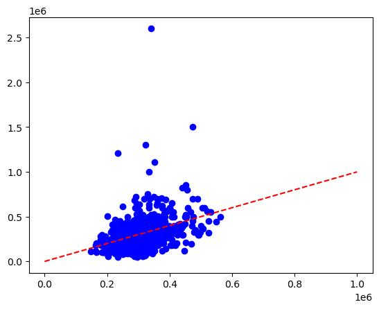
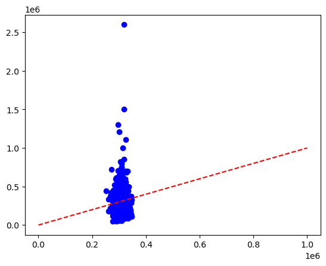
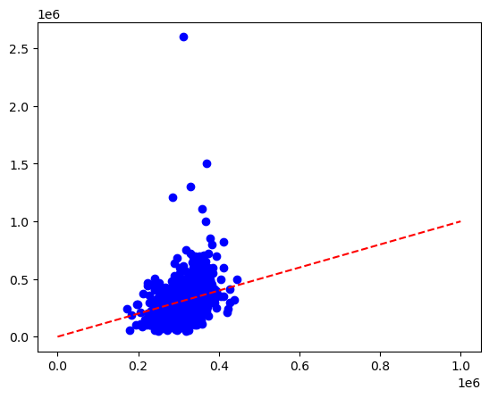

# I. Thông Tin Sinh Viên
- MSSV: 20127158 
- Lê Trần Trung Hiếu
- Lớp Học Phần: 21CLC01

# II. Môi Trường Chạy
- Python 3.11.4 trên MSYS2 (mingw-w64-ucrt-x86_64)
- Các thư viện cần thiết:
    - mingw-w64-ucrt-x86_64-python-numpy
    - mingw-w64-ucrt-x86_64-python-pandas
    - mingw-w64-ucrt-x86_64-python-matplotlib
    - mingw-w64-ucrt-x86_64-python-scikit-learn

# III. Giải Thích Thư Viện Và Hàm
### numpy
Dùng để xử lý tính toán thông thường và trên ma trận, là phần phụ thuộc của các thư viện khác.

### matplotlib
Thư viện dùng để trực quan hóa dữ liệu thành đồ thị

### pandas.read_csv
Hàm đọc một tệp csv và chuyển thành kiểu `Dataframe`. Sau đó, dữ liệu này có thể dùng để tính toán và thống kê tiếp.

### sklearn.linear_model.LinearRegression
Thư viện để tạo mô hình hồi quy tuyến tính sử dụng phương pháp bình phương nhỏ nhất. Áp dụng công thức như sau

$$\mathbf{w} = (\mathbf{X}^\top \mathbf{X})^{-1} \mathbf{X}^\top \mathbf{y}$$

Trong đó:
- $\mathbf{w}$ là vector đối trọng / đặc trưng
- $\mathbf{X}$ là ma trận thuộc tính
- $\mathbf{y}$ là ma trận chứa nhãn yêu cầu

**Lưu ý**: Hàm `OLS_linear_regression` có trình bày cách thực hiện bình phương nhỏ nhất ở mức cơ bản nhưng ta sẽ dùng hàm do thư viện cung cấp vì nhiều lý do, bao gồm tốc độ xử lý và khả năng tương thích tốt với các hàm tiếp theo dùng cùng thư viện.

### sklearn.metrics.mean_absolute_error
Hàm tính độ lỗi tuyệt đối MAE (Mean Absolute Error). Được tính bằng công thức sau:

$$v_\text{MAE} = \frac{1}{n} \sum_{i=1}^{n} |y_i - \hat{y}_i|$$

Trong đó:
- $n$ là số lượng mẫu
- $y_i$ là giá trị thực của mẫu thứ $i$
- $\hat{y}_i$ là giá trị phỏng đoán của mẫu thứ $i$

### sklearn.model_selection.KFold
Hàm để phân một tập dữ liệu lớn thành các tập dữ liệu nhỏ hơn, dùng để so sánh hiệu quả giữa các mô hình với nhau. Luu ý là hàm không trả về trực tiếp tập dữ liệu con, mà trả về index của các giá trị của tập dữ liệu con thuộc tập dữ liệu tổng.

### auto_train_test
Hàm sẽ thực hiện các bước sau đây
1. Nhận các tên thuộc tính đầu vào
2. Tách tập dữ liệu bằng tên các thuộc tính
3. Tính OLS từ tập học
4. Tính MAE dựa trên OLS bằng tập test
5. Trả về MAE và Scater Plot dựa trên giá trị thực và phỏng đoán

### k_fold_cross_validation
Hàm tự động so sánh các tập thuộc tính bằng cách chia k-fold và tính MAE trung bình giữa các tập học 

# IV. Kết Quả
## A. Dùng toàn bộ 11 thuộc tính

$$\text{Salary} = 
Gender * -23183.33
+  10percentage * 702.767
+  12percentage * 1259.019
-  CollegeTier * 99570.608
+  Degree * 18369.962$$
$$
+  collegeGPA * 1297.532
-  CollegeCityTier * 8836.727
+  English * 141.76
+  Logical * 145.742
+  Quant * 114.643
+  Domain * 34955.75$$

$$v_{MAE} = 105052.529$$

## B. So sánh trên 5 Đặc Trưng Tính Cách

| STT | Mô hình với 1 đặc trưng | MAE  |
|:---:|:-----------------------:|:----:|
|  1  | conscientiousness       | 124174.09     |
|  2  | agreeableness           | 123547.02     |
|  3  | extraversion            | 123862.82     |
|  4  | neuroticism             | 123431.33     |
|  5  | openness_to_experience  | 123757.58     |

<b>Đặc Trưng Tốt Nhất: `nueroticism`</b>

$$\text{Salary} = - nueroticism * 16021.493$$
$$v_{MAE} = 119361.917$$

## C. So sánh 3 đặc tính tư duy

| STT | Mô hình với 1 đặc trưng | MAE  |
|:---:|:-----------------------:|:----:|
|  1  | English			        | 120692.46     |
|  2  | Logical		            | 120166.21     |
|  3  | Quant		            | 117250.56     |

<b>Đặc Trưng Tốt Nhất: `Quant`</b>

$$\text{Salary} = Quant * 368.852$$
$$v_{MAE} = 108814.059$$

## D. So sánh 5 đặc trưng tự chọn
**Lưu ý**: Để biết mỗi thuộc tính phía dưới bao gồm những biến nào, xem phần `Tìm Mô Hình`

| STT | Tên Mô hình | Mô tả | MAE  |
|:---:|:-----------------------:| - |:----:|
|  1  | knowledge     | Chứa 4 thuộc tính, chỉ kiến thức của sinh viên   | 115407.27     |
|  2  | personality   | Chứa 5 thuộc tính, chỉ tính cách của sinh viên  | 122910.35     |
|  3  | skills		  | Chứa 7 thuộc tính, chỉ kĩ năng trong các lĩnh vực công nghiệp của sinh viên  | 120921.65     |
|  4  | study		  | Chứa 3 thuộc tính, quá trình học vấn của sinh viên  | 118118.35     |
|  5  | luck		  | Chứa 2 thuộc tính mà sinh viên không thể tự điều chỉnh được  | 123277.08     |

<b>Đặc Trưng Tốt Nhất: `knowledge`</b>

$$\text{Salary} =  English * 178.566
+  Logical * 217.663
+  Quant * 235.573$$
$$v_{MAE} = 108185.48$$

# V. Bảng Tự Đánh Giá
Mức độ hoàn thành: **100%**

| Mục   | A    | B    | C    | D    | Tổng    |
| -     | -    | -    | -    | -    | -       |
| **1** | 2/2  | 1/1  | 1/1  | 3/3  | **7/7** |
| **2** | -    | -    | -    | -    | **3/3** |

# VI. Trích Nguồn
- https://scikit-learn.org/stable/modules/generated/sklearn.linear_model.LinearRegression.html
- https://scikit-learn.org/stable/modules/generated/sklearn.metrics.mean_absolute_error.html
- https://scikit-learn.org/stable/modules/generated/sklearn.model_selection.KFold.html
